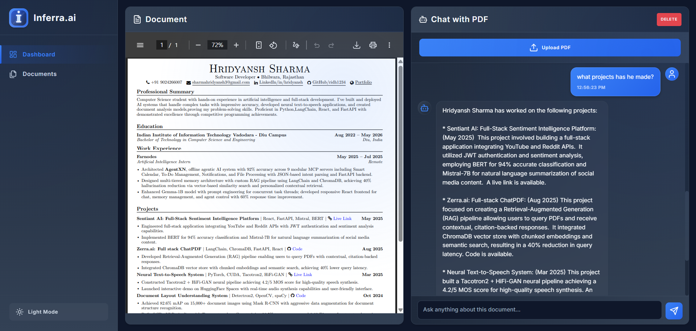
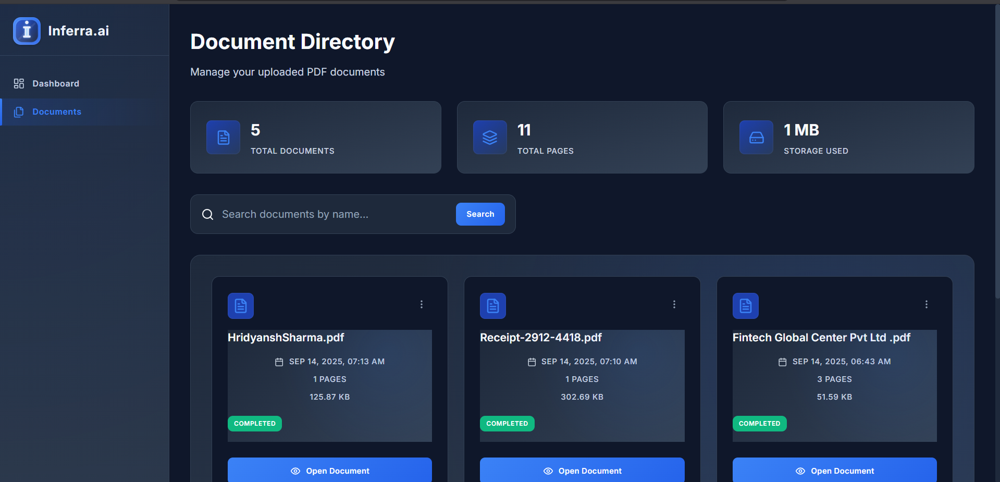
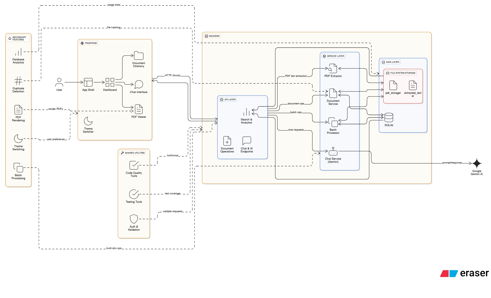
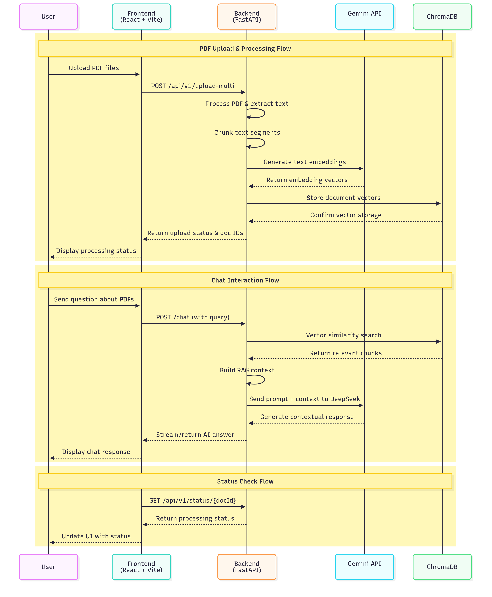

# 🚀 Zerra.ai - Intelligent ChatPDF Platform

<div align="center">


**Transform your PDFs into interactive conversations with AI**

[](https://fastapi.tiangolo.com/)
[](https://reactjs.org/)
[](https://ai.google.dev/)
[](https://www.sqlite.org/)

[📚 Documentation](#documentation) • [🚀 Quick Start](#quick-start) • [✨ Features](#features) • [🏗️ Architecture](#architecture)

</div>

---

## 📖 Overview

**Zerra.ai** is a cutting-edge document processing platform that revolutionizes how you interact with PDF documents. Using advanced AI technology powered by Google Gemini, it enables natural language conversations with your documents, automatic summarization, and intelligent insight extraction.

### 🎯 What Makes Zerra.ai Special?

- **🤖 AI-Powered Conversations**: Chat naturally with your PDFs using Google Gemini 1.5 Flash
- **📄 Smart Document Processing**: Advanced text extraction and content analysis
- **🔍 Intelligent Search**: Full-text search across all your documents
- **💡 Automatic Insights**: Generate summaries and extract key information
- **🎨 Beautiful Interface**: Modern, responsive design with dark/light themes
- **⚡ High Performance**: Optimized for speed with duplicate detection and caching

---

## 🖼️ Screenshots

### Modern Dashboard Interface
<div align="center">

<p><em>Clean, intuitive dashboard for document upload and AI chat interactions</em></p>
</div>

### Document Management & Chat Interface
<div align="center">

<p><em>Comprehensive document directory with integrated PDF viewer and chat</em></p>
</div>

---

## 🏗️ Architecture

### System Architecture Overview
<div align="center">

<p><em>Comprehensive system architecture showing all components and their relationships</em></p>
</div>

### Data Flow Diagram
<div align="center">

<p><em>Detailed data flow showing how information moves through the system</em></p>
</div>

---

## ✨ Features

### 🚀 Core Capabilities

| Feature | Description |
|---------|-------------|
| **📤 PDF Upload** | Drag-and-drop PDF upload with progress tracking |
| **🤖 AI Chat** | Natural conversation with document content |
| **📊 Smart Summaries** | Automatic document summarization and key insights |
| **🔍 Full-Text Search** | Search across all documents and content |
| **📱 Responsive Design** | Works perfectly on desktop, tablet, and mobile |
| **🌙 Theme Support** | Beautiful dark and light themes |
| **⚡ Duplicate Detection** | Smart handling of duplicate documents |
| **📈 Analytics** | Document statistics and usage metrics |

### 🛠️ Technical Features

- **Async Processing**: Non-blocking operations for optimal performance
- **Database Optimization**: Indexed queries and efficient storage
- **Error Handling**: Graceful degradation and user-friendly messages
- **Security**: SQL injection protection and input validation
- **Scalability**: Designed to handle large document collections

---

## 🚀 Quick Start

### Prerequisites

- **Python 3.8+** with pip
- **Node.js 16+** with npm
- **Git** for version control

### 🔧 Installation

1. **Clone the repository**
   ```bash
   git clone https://github.com/yourusername/zerra-ai.git
   cd zerra-ai
   ```

2. **Setup Backend**
   ```bash
   cd Backend
   
   # Create virtual environment
   python -m venv venv
   
   # Activate virtual environment
   # On Windows:
   .\venv\Scripts\Activate.ps1
   # On macOS/Linux:
   source venv/bin/activate
   
   # Install dependencies
   pip install -r requirements.txt
   ```

3. **Configure Environment**
   ```bash
   # Create .env file in Backend directory
   echo "GEMINI_API_KEY=your_gemini_api_key_here" > .env
   ```

4. **Setup Frontend**
   ```bash
   cd ../Frontend
   npm install
   ```

### 🚀 Running the Application

1. **Start Backend Server**
   ```bash
   cd Backend
   .\venv\Scripts\Activate.ps1  # Activate virtual environment
   uvicorn app.main:app --reload --host 0.0.0.0 --port 8000
   ```

2. **Start Frontend Development Server**
   ```bash
   cd Frontend
   npm run dev
   ```

3. **Access the Application**
   - Frontend: `http://localhost:5173`
   - Backend API: `http://localhost:8000`
   - API Documentation: `http://localhost:8000/docs`

---

## 🛠️ Tech Stack

### Backend Technologies
<div align="center">

| Technology | Purpose | Version |
|------------|---------|---------|
| **FastAPI** | Web Framework | 0.111.0 |
| **Google Gemini** | AI Language Model | 1.5 Flash |
| **SQLite** | Database | Built-in |
| **PyMuPDF** | PDF Processing | 1.24.4 |
| **Uvicorn** | ASGI Server | 0.30.0 |
| **Pydantic** | Data Validation | 2.8.0 |

</div>

### Frontend Technologies
<div align="center">

| Technology | Purpose | Version |
|------------|---------|---------|
| **React** | UI Framework | 18.2.0 |
| **Vite** | Build Tool | 5.2.0 |
| **React Router** | Navigation | 6.22.0 |
| **Axios** | HTTP Client | 1.6.8 |
| **Lucide React** | Icons | 0.400.0 |
| **React PDF** | PDF Viewer | 7.7.1 |

</div>

---

## 📊 API Documentation

### Core Endpoints

#### Document Operations
```http
POST   /api/v1/upload-pdf        # Upload and process PDF
GET    /api/v1/documents         # List all documents
GET    /api/v1/documents/{id}    # Get document details
DELETE /api/v1/documents/{id}    # Delete document
```

#### AI Chat Operations
```http
POST   /api/v1/chat              # Chat with document
GET    /api/v1/documents/{id}/summary  # Get document summary
```

#### Search & Analytics
```http
GET    /api/v1/search?query=...  # Search documents
GET    /api/v1/stats             # Platform statistics
```

### Example API Usage

```javascript
// Upload a PDF
const formData = new FormData();
formData.append('file', pdfFile);
const response = await axios.post('/api/v1/upload-pdf', formData);

// Chat with document
const chatResponse = await axios.post('/api/v1/chat', {
  question: "What is this document about?",
  document_id: 123
});
```

---

## 🏗️ Project Structure

```
Zerra.ai/
├── 📁 Backend/
│   ├── 📁 app/
│   │   ├── main.py              # FastAPI application
│   │   ├── 📁 api/
│   │   │   └── extract.py       # API endpoints
│   │   └── 📁 services/
│   │       ├── chat_service.py      # AI chat logic
│   │       ├── document_service.py  # Document management
│   │       ├── pdf_extractor.py     # PDF processing
│   │       └── database_service.py  # Database operations
│   ├── requirements.txt         # Python dependencies
│   └── 📁 tests/               # Test files
├── 📁 Frontend/
│   ├── 📁 src/
│   │   ├── App.jsx             # Main React component
│   │   └── 📁 components/
│   │       ├── Dashboard.jsx        # Main dashboard
│   │       └── DocumentDirectory.jsx # Document browser
│   ├── package.json            # Node.js dependencies
│   └── vite.config.js          # Vite configuration
├── Interface1.png              # UI Screenshots
├── Interface2.png
├── Arch.png                    # Architecture diagram
├── Dataflow.png               # Data flow diagram
└── README.md                  # This file
```

---

## 🔧 Configuration

### Environment Variables

Create a `.env` file in the `Backend` directory:

```bash
# Required
GEMINI_API_KEY=your_google_gemini_api_key

# Optional
ZERRA_DB_PATH=/custom/path/database.db
ZERRA_LOG_LEVEL=INFO
CORS_ORIGINS=http://localhost:5173,http://127.0.0.1:5173
```

### Getting Google Gemini API Key

1. Visit [Google AI Studio](https://makersuite.google.com/app/apikey)
2. Create a new API key
3. Add it to your `.env` file

---

## 🧪 Testing

### Run Backend Tests
```bash
cd Backend
pytest tests/ -v
```

### Run Frontend Tests
```bash
cd Frontend
npm test
```

### Integration Testing
```bash
cd Backend
python test_database_integration.py
```

---

## 🚀 Deployment

### Production Setup

1. **Backend Deployment**
   ```bash
   # Install production dependencies
   pip install gunicorn
   
   # Run with Gunicorn
   gunicorn app.main:app -w 4 -k uvicorn.workers.UvicornWorker
   ```

2. **Frontend Build**
   ```bash
   cd Frontend
   npm run build
   ```

3. **Environment Configuration**
   - Set production environment variables
   - Configure reverse proxy (nginx/Apache)
   - Set up SSL certificates

---

## 🤝 Contributing

We welcome contributions! Please see our [Contributing Guidelines](CONTRIBUTING.md) for details.

### Development Workflow

1. Fork the repository
2. Create a feature branch (`git checkout -b feature/amazing-feature`)
3. Commit your changes (`git commit -m 'Add amazing feature'`)
4. Push to the branch (`git push origin feature/amazing-feature`)
5. Open a Pull Request

---

## 📝 License

This project is licensed under the MIT License - see the [LICENSE](LICENSE) file for details.

---

## 🙏 Acknowledgments

- **Google Gemini AI** for powerful language processing
- **FastAPI** for the excellent web framework
- **React** for the robust frontend framework
- **PyMuPDF** for reliable PDF processing
- **Lucide** for beautiful icons

---

## 📞 Support

- 📧 **Email**: support@zerra.ai
- 💬 **Discord**: [Join our community](https://discord.gg/zerra-ai)
- 📖 **Documentation**: [docs.zerra.ai](https://docs.zerra.ai)
- 🐛 **Issues**: [GitHub Issues](https://github.com/yourusername/zerra-ai/issues)

---

<div align="center">

**Made with ❤️ by the Zerra.ai Team**

⭐ **Star us on GitHub if you find this project helpful!** ⭐

[🚀 Deploy Now](https://deploy.zerra.ai) • [📖 Documentation](https://docs.zerra.ai) • [💬 Community](https://discord.gg/zerra-ai)

</div>
